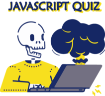

# Javascript Quiz
First of all, all the questions about Javascript are from this repository : [lydiahallie/javascript-questions](https://github.com/lydiahallie/javascript-questions).

Find the authoress in [Instagram](https://www.instagram.com/theavocoder) | [Twitter](https://www.twitter.com/lydiahallie) | [Linkedin](https://www.linkedin.com/in/lydia-hallie)

-----


Illustration by [Tatyana Krasutskaya](https://icons8.com/illustrations/author/iAdLsFJOKDrk) from [Ouch!](https://icons8.com/illustrations)

## Overview


### Links


### Start with
```bash
# Clone this repository
$ git clone https://github.com/TKadyear/javascript-quiz.git

# Go into the repository
$ cd javascript-quiz

# Install dependencies
$ npm install

# Run the local server
$ npm run dev
```

If you want the production server do:
```bash
#For prepare the documents for production:
$ npm run build

#Run the preview of production server
$ npm run preview
```

## Author
  - Github - [TKadyear](https://github.com/TKadyear)
  - Linkedin - [Tamara Kadyear Saber](https://www.linkedin.com/in/tamara-kadyear-saber/)
